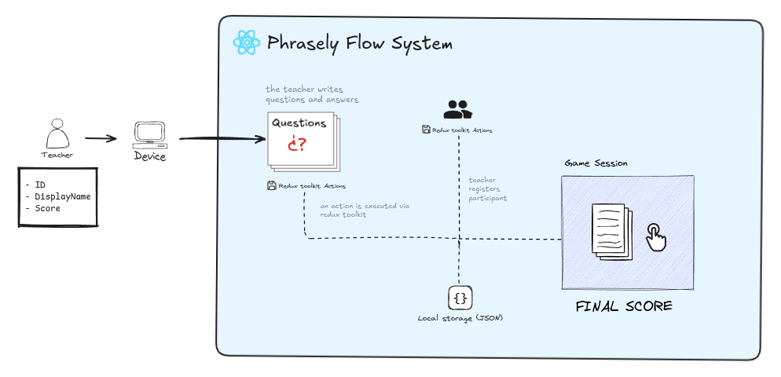

# Phrasely

## Description

> **Phrasely** it's a Open Source educational english games creator made by `@eehcx`, `@mAbimael700` and `@Peter2k3` students of **Polytechnic University of the Center.**

### Hooks usage

At this moment are avialable hooks for registered questions, teachers, and guest: `useQuestion` and `useUser`

#### Usage example

```typescript
import { useUser } from '../hooks/useUser';

const AddTeacher: React.FC = () => {
  const { registerNewTeacher } = useUser();

  const handleRegisterTeacher = () => {
    registerNewTeacher({ id: '1', displayName: 'John Doe', email: 'john.doe@example.com' });
  };

  return <button onClick={handleRegisterTeacher}>Register Teacher</button>;
};

import { StrictMode } from 'react'
import { createRoot } from 'react-dom/client'

import { Provider } from 'react-redux';
import { PersistGate } from 'redux-persist/integration/react';
import '@/index.css'
import App from './App.tsx'
import { store, persistor } from './redux/store.ts'; 

createRoot(document.getElementById('root')!).render(
  <StrictMode>
    <Provider store={store}>
      <PersistGate loading={null} persistor={persistor}>
        <App />
      </PersistGate>
    </Provider>
  </StrictMode>,
)

```

### Redux toolkit usage

If you want to show the information saved in the local storage, you ony need to call the `useAppSelector` hook in your component.

```typescript
import { useAppSelector } from '../redux/reduxHooks';

const TeacherInfo: React.FC = () => {
  const teacher = useAppSelector((state) => state.user.teacher);

  if (!teacher) {
    return <p>No teacher registered</p>;
  }

  return (
    <>
      <p>{teacher.displayName}</p>
      <p>{teacher.email}</p>
    </>
  );
};
```

> In the same way your should to query all the `slices` in the app.

#### Import redux hook

You only import the **useAppSelector** from `/redux/reduxHooks.ts` directory

```typescript
import { useAppSelector } from '../redux/reduxHooks';
```

#### Initialize AppSelector

- **slice**: represent any slice in redux like `question` or `user` slices.
- **interface**: represent an interface assigned for the slice like `teacher`, `guests`, `questions` or `current`.

```typescript
const interface = useAppSelector((state) => state.slice.interface);
```

#### Show the content

You only need to call the const where do you keep the information of the AppSelector.

```typescript
const ShowInfo: React.FC = () => {
  return (
    <>
      <p>{interface.content}</p>
    </>
  );
};
```

*For more information about the content of the slices query **./src/types/***


*Workflow of **pharasely** webapp*

Para más detalles, sobre la configuración de vite [Consulta aquí](./docs/setup.md).